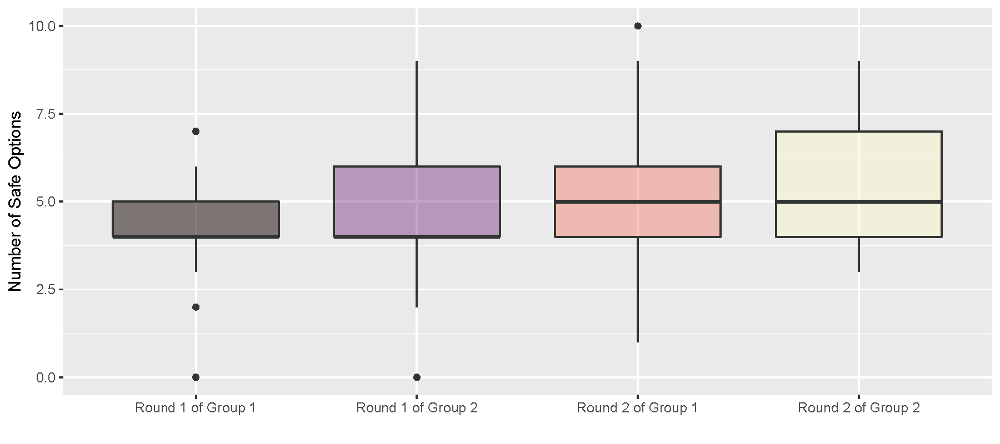
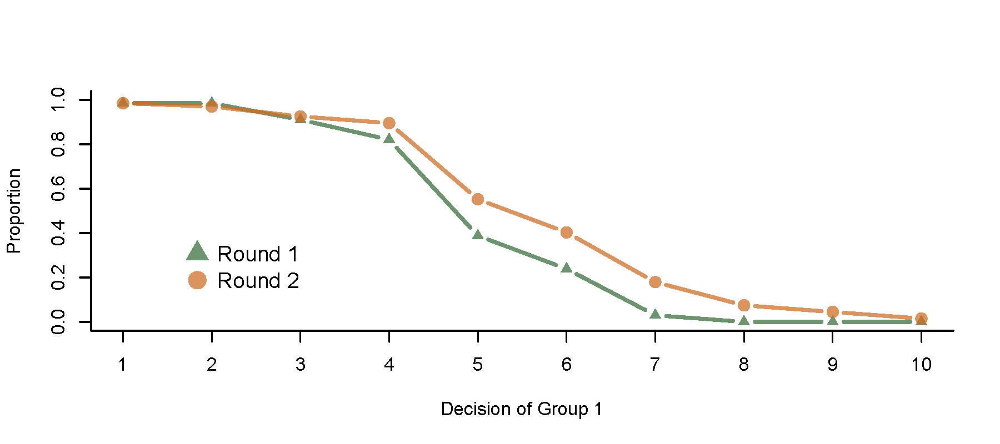
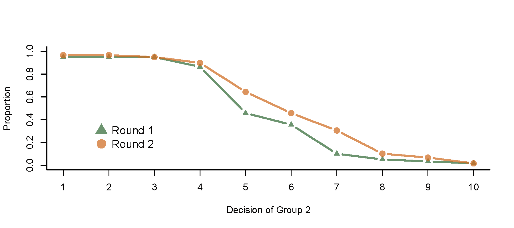
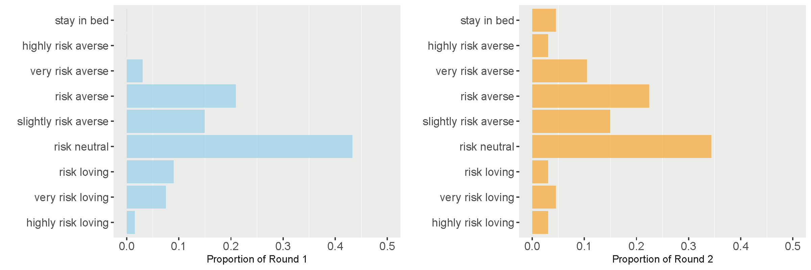
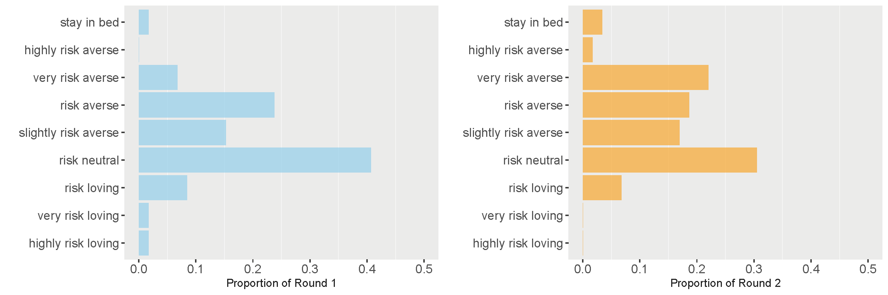
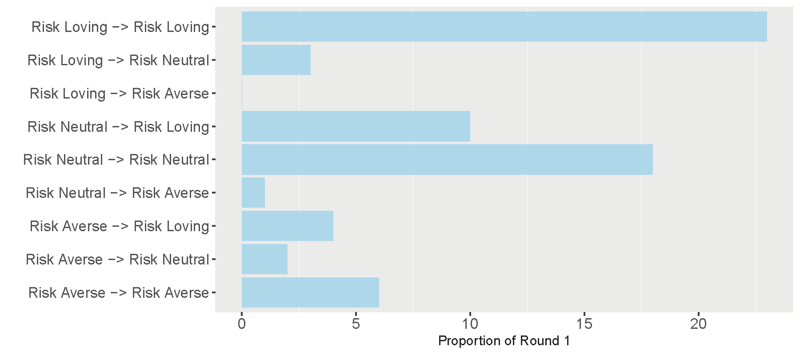
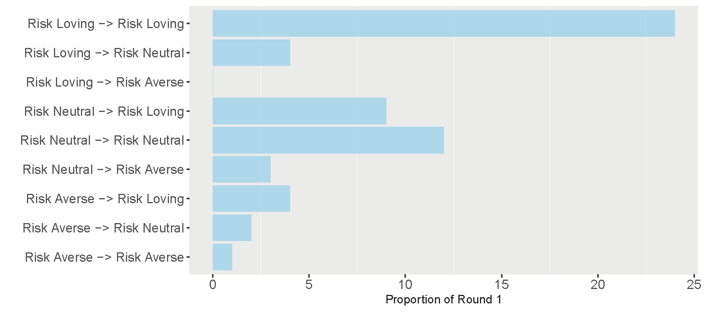
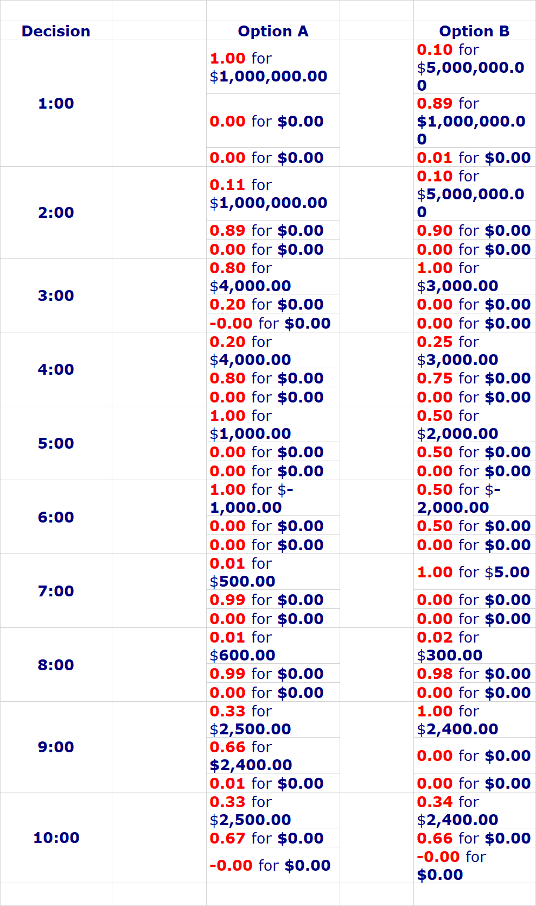

<strong>Lottery-choice Experiments</strong>

<strong>Date: 2021.3.16</strong>

# Lab 1 - Lottery Choice Experiment

## 1. The Structure of the Experiment

In the first experiment, all the students divided into 2 group(68 students for the group 1 and 60 students for the group2, and some incomplete data will be removed before statistic analysis) have to complete the experiment on the Veconlab website`http://veconlab.econ.virginia.edu/`.

Two rounds of lottery-choice experiment is taken to analysis the risk attitudes of decision makers. For each round, given the return and its corresponding probability of each option(shown in the table below), decision makers are required to make ten decisions between options A and B, and only one option can be chosen in each decision. After decisions, their return will be calculated through computer simulation of random sampling method. Specifically, the computer will generate two integers randomly and equally probabilistic between 1 and 10. One of the integers is used to decide which decision will be chosen(for example, `1` means the first decision will be used), and the other is used to decide the final payoffs(for example, in the first decision of Round 1, `1 ` means the payoff is 4.00\$ and `2-10` means 3.20\$):

*Round 1:*

| Decision | Option A                                        | Option B                            |
| -------- | ----------------------------------------------- | ----------------------------------- |
| 1        | 1/10 of 4.00\$ (1) 9/10 of 3.20\$ (2-10)   | 1/10 of 7.70\$ 9/10 of 0.20\$  |
| 2        | 2/10 of 4.00\$ (1-2) 8/10 of 3.20\$ (8-10) | 2/10 of 7.70\$ 8/10 of 0.20\$  |
| 3        | 3/10 of 4.00\$ (1-3) 7/10 of 3.20\$ (7-10) | 3/10 of 7.70\$ 7/10 of 0.20\$  |
| 4        | 4/10 of 4.00\$ (1-4) 6/10 of 3.20\$ (5-10) | 4/10 of 7.70\$ 6/10 of 0.20\$  |
| 5        | 5/10 of 4.00\$ (1-5) 5/10 of 3.20\$ (6-10) | 5/10 of 7.70\$ 5/10 of 0.20\$  |
| 6        | 6/10 of 4.00\$ (1-6) 4/10 of 3.20\$ (7-10) | 6/10 of 7.70\$ 4/10 of 0.20\$  |
| 7        | 7/10 of 4.00\$ (1-7) 3/10 of 3.20\$ (8-10) | 7/10 of 7.70\$ 3/10 of 0.20\$  |
| 8        | 8/10 of 4.00\$ (1-8) 2/10 of 3.20\$ (9-10) | 8/10 of 7.70\$ 2/10 of 0.20\$  |
| 9        | 9/10 of 4.00\$ (1-9) 1/10 of 3.20\$ (10)   | 9/10 of 7.70\$ 1/10 of 0.20\$  |
| 10       | 10/10 of 4.00\$ (1-10) 0/10 of 3.20\$      | 10/10 of 7.70\$ 0/10 of 0.20\$ |

*Round 2:*

| Decision | Option A                              | Option B                             |
| -------- | ------------------------------------- | ------------------------------------ |
| 1        | 1/10 of 40.00\$ 9/10 of 32.00\$  | 1/10 of 77.00\$ 9/10 of 2.00\$  |
| 2        | 2/10 of 40.00\$ 8/10 of 32.00\$  | 2/10 of 77.00\$ 8/10 of 2.00\$  |
| 3        | 3/10 of 40.00\$ 7/10 of 32.00\$  | 3/10 of 77.00\$ 7/10 of 2,00\$  |
| 4        | 4/10 of 40.00\$ 6/10 of 32.00\$  | 4/10 of 77.00\$ 6/10 of 2.00\$  |
| 5        | 5/10 of 40.00\$ 5/10 of 32.00\$  | 5/10 of 77.00\$ 5/10 of 2.00\$  |
| 6        | 6/10 of 40.00\$ 4/10 of 32.00\$  | 6/10 of 77.00\$ 4/10 of 2.00\$  |
| 7        | 7/10 of 40.00\$ 3/10 of 32.00\$  | 7/10 of 77.00\$ 3/10 of 2.00\$  |
| 8        | 8/10 of 40.00\$ 2/10 of 32.00\$  | 8/10 of 77.00\$ 2/10 of 2.00\$  |
| 9        | 9/10 of 40.00\$ 1/10 of 32.00\$  | 9/10 of 77.00\$ 1/10 of 2.00\$  |
| 10       | 10/10 of 40.00\$ 0/10 of 32.00\$ | 10/10 of 77.00\$ 0/10 of 2.00\$ |

According to the difference of the return of two results, Option A is regarded as the safe option, and the Option B is regarded as the risk option. 

In this experiment, my ID number is 15, and my decision is `SSRRRRRRRR` for round 1 and `SRRRRRRRRR` for round 2, where `S`  and `R` represents the safe option A and the risk option B, respectively. Since the decisions is made alone, I think there is no interaction  between participants when making decisions. 

## 2. The Theory the Experiment was Designed to Test

### 2.1. Expected Utility Hypothesis

The **expected utility hypothesis** is a popular concept in economics, which recommends which option a rational individual should choose in a complex situation, based on his tolerance for risk and personal preferences.

The idea has antecedents in Daniel Bernoulli's 1738 St. Petersburg Paradox, and was developed by Frank Ramsey and Leonard Jimmie Savage, The von Neumann–Morgenstern utility theorem provides necessary and sufficient conditions under which the expected utility hypothesis holds. From relatively early on, it was accepted that some of these conditions would be violated by real decision-makers in practice but that the conditions could be interpreted nonetheless as axioms' of rational choice. Until the mid-twentieth century, the standard term for the expected utility was the moral expectation, contrasted with "mathematical expectation" for the expected value.

As for the expectation utility function, which is also called VNM utility function, it has the formula below:
$$
EU=\sum U(x_i)p_i
$$
And the concept behind it is that under the uncertain circumstance the final utility is measured by adding all the weighted values of utility in corresponding situations. And the goal of the decision maker is to maximize the weighted utility, which has a  inseparable relationship with decision maker's risk attitude.

**Axiomatic hypothesis:**

There are four important assumptions in the theory of expected utility hypothesis:

- Cancellation:

  Decision maker will cancel the state that the same result will be produced with any choice made by decision maker. Finally, only one state can be realized, so that different options can be reasonably evaluated separately.

- Transitivity:

  For a decision maker, if the utility of A is larger than the utility of B and the utility of B is larger than the utility of C, which means $u(A)>u(B)$ and $u(B)>u(C)$, we can conclude $u(A)>u(C)$.

- Dominance:

  If one option is better than another in a certain state, and at least as good as the other in all other states, the option is dominant and should be chosen.

- Invariance:

  Different expressions of the same choice problem should produce the same preference, which means the preference among various options should be independent of their description.

### 2.2. Risk Attitude and Utility Function

It is assumed that the decision maker with a certain choice will obtain one of two payoffs, which payoffs is $X_1$ with possibility $p$ and the other is $X_2$ with possibility $1-p$:

- Risk Averse:
  $$
  U[pX_1+(1-p)X_2]>pU(X_1)+(1-p)U(X_2)
  $$
  For the risk averse, given a certain expected value, they prefer to take smaller risks.

- Risk Neutral:
  $$
  U[pX_1+(1-p)X_2]=pU(X_1)+(1-p)U(X_2)
  $$
  For the risk neutral, given a certain expected value, different options have the same utility to them.

- Risk Loving:
  $$
  U[pX_1+(1-p)X_2]<pU(X_1)+(1-p)U(X_2)
  $$
  For the risk loving, given a certain expected value, they would like to choose the one with higher risk.

### 2.3. Risk Attitude Measurement

Since the difference between the two possible payoffs of Option A(\$4,\$3.2 in round 1; \$40, \$32 in round 2) is less than that of Option B(\$7.7,\$0.2 in round 1; \$77, \$2 in round 2), we consider the Option A as the safe option and the option B as the risk option(shown in the table below).

| Number of Safe Choices | Risk Preference Classification |
| ---------------------- | ------------------------------ |
| 0-1                    | highly risk loving             |
| 2                      | very risk loving               |
| 3                      | risk loving                    |
| 4                      | risk neutral                   |
| 5                      | slightly risk averse           |
| 6                      | risk averse                    |
| 7                      | very risk averse               |
| 8                      | highly risk averse             |
| 9-10                   | stay in bed                    |

And the risk attitude measurement of the decision maker is based on the number and proportion of safe choices.

- Risk Averse: Number of Safe Choices in one Round > 4
- Risk Neutral: Number of Safe Choices in one Round = 4
- Risk Loving: Number of Safe Choices in one Round < 4

## 3. Summary of the Results

Before analyzing the results, I calculate the expected value of each option(shown in the table below) as reference, and we can find the in all the first four(Decision 1-4), the expected return of option A is more than the Option B, and in the other decisions the expected return of option A is less than that of the Option B.

*Round 1:*

| Decision | Option A | Option B |
| -------- | -------- | -------- |
| 1        | 3.28$    | 0.95\$   |
| 2        | 3.36$    | 1.70\$   |
| 3        | 3.44$    | 2.45\$   |
| 4        | 3.52$    | 3.20\$   |
| 5        | 3.60\$   | 3.95\$   |
| 6        | 3.68\$   | 4.70\$   |
| 7        | 3.76\$   | 5.45\$   |
| 8        | 3.84\$   | 6.20\$   |
| 9        | 3.92\$   | 6.95\$   |
| 10       | 4.00\$   | 7.70\$   |

*Round 2:*

| Decision | Option A | Option B |
| -------- | -------- | -------- |
| 1        | 32.80$   | 9.50\$   |
| 2        | 33.60$   | 17.00\$  |
| 3        | 34.40$   | 24.50\$  |
| 4        | 35.20$   | 32.00\$  |
| 5        | 36.00\$  | 39.50\$  |
| 6        | 36.80\$  | 47.00\$  |
| 7        | 37.60\$  | 54.50\$  |
| 8        | 38.40\$  | 62.00\$  |
| 9        | 39.20\$  | 69.50\$  |
| 10       | 40.00\$  | 77.00\$  |

According to the expected utility hypothesis, people will choose the option with the highest utility calculated by their risk attitude. So the expected value may not be the only factor that leads to the final decisions.

After cleaning all the data, I obtain 67 samples in group 1 and 59 samples in group 2(**incomplete data are deleted**). Using `R` programming, the data is visualized:

             
Boxplot for the Number of Safe Options
 

As shown in the figure above, there are some outliers in Group 1 and Round 2 of Group 2. We also can find that the median values of each group raise from Round 1 to Round 2, which may be caused the change of participants risk attitude(become more conservative overall). Moreover,  the larger IQR(the length of box becomes larger) from Round 1 to Round 2 means the middle half of the data has more variability.

From the figures below, we can find the tow groups have some common features. First, the differences between Round 1and Round 2 in the first four and the last three decision are relatively small and are relatively large in the other decisions. Moreover, the line of Round 2 is above the the line of Round1 in most cases of Group 1 and Group 2. Thus, we can conclude that with the expansion of payoffs of the two results in each options, which is from small one(4\$, 3.2\$; 7.7\$, 0.2\$) to large one(40\$, 32\$; 77\$, 2\$), the decision makers in both Group 1 and Group 2 change their attitude towards earnings and risk and become conservative overall, which means compared to Round1 more safe options are chosen in the Round 2.

             
Proportion of Safe Choices for Each Decision in Group 1
 

             
Proportion of Safe Choices for Each Decision in Group 2
 

Moreover, I plot the bar charts(shown in the figures below) to analysis the distribution of decision makers' risk attitude. And we can find that after expanding the payoffs, for both group 1 and group 2, the most proportions of the risk loving decreased and the proportion of the risk averse increased, which is similar to the conclusion above that participants become more conservative overall.

             
Proportion of Different Risk Attitude in Group 1
 

             
Proportion of Different Risk Attitude in Group 2
 

But we cannot conclude where the change of the proportion of different risk attitudes come from only through the figures above. To take a deep analysis of the change of people's risk attitude, I counted the specific changes in people's risk attitudes(shown in the figures below; `A -> B` means the number of decision makers who show A attitude in Round 1 and change to B attitude in Round 2):

             
Change of Risk Attitude in Group 1
 

             
Change of Risk Attitude in Group 2
 

And we can find that in all the three risk attitudes, most of the risk loving in Group 1 and 2 did not change their attitude, which means a risk-loving participant in Round 1 will probably still choose the risk-loving options after payoffs increases in Round 2. And also, in Group 1 and 2, none of they changed their attitude to `Risk Averse`. In addition, the increment of payoffs makes a large part of risk-averse change their attitude to `Risk Loving` in Group 1 but do not change in Group 2.

## 4. My Decisions and Experience

In the first experiment, I am in the Group 1 and ID number is 15. The table below is my decisions and results:

| Decision | Options in Round 1 | Options in Round 2 |
| -------- | ------------------ | ------------------ |
| 1        | S                  | S                  |
| 2        | S                  | R                  |
| 3        | R                  | R                  |
| 4        | R                  | R                  |
| 5        | R                  | R                  |
| 6        | R                  | R                  |
| 7        | R                  | R                  |
| 8        | R                  | R                  |
| 9        | R                  | R                  |
| 10       | R                  | R                  |

|                | Round 1 | Round 2 |
| -------------- | ------- | ------- |
| Decision  Used | 4       | 9       |
| Die Throw      | 8       | 9       |
| Earnings       | 0.2     | 77      |

In Round 1, before making decisions, I thought the differences between the two payoffs of each option -- that was, $7.7-0.2=7.5$ and $4.0-3.2=0.8$ -- were small, so that the risk of Option B is tolerable of me. After that, I calculated the expected value of each options and found in only the first four decisions Option A had higher expected values than Options B, so I thought Options B in the first four decision would cause more risk to my final return. Thus, according to my tolerance of risk and the expected values, I decided to choose Options B in some of the first four decisions and all the remaining options(5-10). Then, I had to decide, among the first four decisions, which one should I choose to give the Option B. And I found in the first two decisions the possibility of Option B to get the best payoff is too small. Thus, finally, I chose Option A in the first two decisions(1-2) and Option B in all the remaining options(3-10).

In Round 2, with the payoff increased, the difference between the two payoffs also increased. As for me, the difference($77-2=75$) of Option B was too larger than that($40-32=8$) of Option A that I thought the difference of Option B was not tolerable for me. But just before choosing the options, I thought although the risk increased, the payoffs also increased. Even if the worst happens, I still would be paid 32\$, which was even much larger than the max payoff in Round 1. So I decided to take more risks and chose more risk options -- that was, Option A for only the first decision and Option B for all the other decisions.

## 5. What I learnt from the experiment

When we are asked to make a decision which may lead to two or even more different results, the main goal of us is trying to maximize our expected utility. And the process to achieve it is a trad-off  between the risk and benefit according to our own expected utility function. 

By asking a group of people to participate in this experiment, we can find their general attitude towards the risk and benefit -- that is, help us to analysis whether this group is risk-loving, risk-neutral or risk-averse.  

According to the theory of probability, when we keep making a same decision with the possibility of different results known, if we always choose the one with higher expected values, we will finally obtain payoff around the expected values. But when we faces decisions in a real world, it's hard for us to do that, since we need to consider its risk and my risk attitude for each decision -- whether I should take a risk for a better future or just pursue the stability of life. It a question without a standard answer.

# Lab 2 - Pairwise Lottery Choice Experiment

## 1. The Structure of the Experiment

For a long time, the standard expected utility theory has be violated by individual choice experiment. And the main goal of this experiment is to test the expected utility hypothesis and have a deeper analysis of decision maker's  behavior when making decisions.

Similar to the first experiment, all the students were divided into 2 group(67 students for the group 1 and 60 students for the group2, and some incomplete data will be removed before statistic analysis) have to complete the experiment on the Veconlab website`http://veconlab.econ.virginia.edu/`.

For each individual, given the possibility of the results of different options, they are required to choice an option between Option A and B(shown in the table below). And the results will be decided by computer simulation of random sampling method. For examples, in the second decision, if participant choose the Option A, there is a 11% probability of obtaining 1,000,000.00$ and a 89% probability of nothing.

             
Decision in Pairwise Lottery Choice Experiment
 

In this experiment, my ID number is 55, and my decision is `BBBBABBBBA` , where `A`  and `B` represents the option A and the option B, respectively. Since the decisions is made alone, I think there is no interaction  between participants when making decisions. 

## 2. The theory the experiment was designed to test

### 2.1. Challenge to Expected Utility Theory

"Rational man hypothesis" is the basic assumption of expected utility theory. Admittedly, "rational man hypothesis" has been success in theoretically analysis and predicting people's behaviors, there are still a lots evidence violating this assumption in the reality. Thus, although expected utility theory may be reasonable to some extent, the unsubstantiated assumption, rational man hypothesis, which is proven unwarranted in some cases, seriously undermined and challenge the expected utility theory.

### 2.2.  Certainty Effect

Using the concept of **certainty effect** -- that is, people usually give more much or excessive weight to certain things comparing to the uncertainty -- Alai paradox gives the theoretical and experimental evidences, which violates the axiomatic assumptions of transitivity, invariance and etc. In the experiment, It corresponds to Decision 1 and 2(and also, some other decisions have the concept of certainty effext).

For examples, in the Decision 1 and 2, according to Alai paradox, most people may choose Option A in Decision 1 and Option B in Decision 2, which means:

*Decision 1:*
$$
U(1,000,000.00)>0.1U(5,000,000,00)+0.89U(1,000,000.00)+0.01U(0)\\
\Rightarrow 0.11U(1,000,000.00)>0.1U(5,000,000,00)+0.01U(0)
$$
*Decision 2:*
$$
0.1U(5,000,000,00)+0.9U(0)>0.11U(1,000,000.00)+0.89U(0)\\
\Rightarrow0.1U(5,000,000,00)+0.01U(0)>0.11U(1,000,000.00)
$$
And we can find the the results above is inconstant, which seriously challenge the expected utility theory.

### 2.3. Common-Consequence Effect

Common-consequence effect is used described the phenomenon that people may have different preference to the same results. There are some experiments designed to test common-consequence effect showing that it results go against the axiomatic assumptions of transitivity, dominance, invariance and etc. In our experiment, Decision 9 and 10 are used to test this concept.

### 2.4. Common Ratio Effect

Similar to the common-consequence effect, common ratio effect means with the equal proportion transformation of a set of probability, people's decisions will be changed, which violates the axiomatic assumptions of cancellation. The formula expression is as follows:
$$
b1=(\$X,p;\$0,1-p);\\
b2=(\$Y,q;\$0,1-q);\\
b3=(\$X,rp;\$0,1-rp);\\
b4=(\$Y,rq;\$0,1-rq);\\
p>q,\ 0<X<Y,\ 0<r<1
$$
And in the experiment, it corresponds to Decision 3 and 4. Assuming $U(0)=0$, if most people choose Option B in Decision 3 and Option A in Decision 4, we can find $U(4,000.00)/U(3,000)<5/4$ in Decision 3 and $U(4,000)/U(3,000)>5/4$ in Decision 4, which means expected utility theory cannot explain the results.

### 2.5. Reflection Effect

Reflection effect has the concept that people's preference to gains and losses is non-asymmetry: with expectation of losses, individuals have  tendency to accept risks; on the contrary, with expectation of gains, individuals have a tendency to avoid risks. And it amended the certainty effect. In the experiment, it corresponds to decision 5 and 6.

### 2.6. Preference Reversal

Preference reversal refers to the phenomenon that individual preference is inconsistent in choice and pricing. Specifically, there are two kinds of lotteries available to be chosen -- chance lottery(high probability to win but the payoff of winning is small) and money lottery(low probability to win but the payoff of winning is large). According to some experiments, researches found that participants choosing the chance lottery gave a higher price to the money lottery, which means individuals' choice and evaluation were not constant. In the experiment, it corresponds to decision 7 and 8, but since I have no data of individuals' evaluation of the options, preference reversal cannot be tested in this experiment.

## 3. Summary of the Results

After cleaning all the data, I obtain 66 samples in group 1 and 59 samples in group 2(**incomplete data are deleted**, which leads to a slight difference between my results and the results in Excel).

**Certainty Effect:**

*Group 1:*

|                            | Option A in Decision 1 | Option B in Decision 1 | Sum  |
| :------------------------- | :--------------------- | :--------------------- | :--- |
| **Option A in Decision 2** | 0.00000000             | 0.000000               | 0    |
| **Option B in Decision 2** | 0.03030303             | 0.969697               | 1    |
| **Sum**                    | 0.03030303             | 0.969697               | 1    |

*Group 2:*

|                            | Option A in Decision 1 | Option B in Decision 1 | Sum        |
| :------------------------- | :--------------------- | :--------------------- | :--------- |
| **Option A in Decision 2** | 0.05084746             | 0.01694915             | 0.06779661 |
| **Option B in Decision 2** | 0.18644068             | 0.74576271             | 0.93220339 |
| **Sum**                    | 0.23728814             | 0.76271186             | 1.00000000 |

According to Alai paradox, the Option A in Decision 1 and Option B in Decision 2 should be chosen, which will disprove the expected utility theory. But in our experiment, we can find the most of the participants chose the Option B in Decision 1 and Option B in Decision 2. And basically, the two groups shows the similar results. But we still can find small proportion of participants affected by the certainty effect in Group 2.

Owing to my own perspectives, I think it is the probability of no payoff in Decision 1 Option B that too small to be considered by the participants.

**Common-Consequence Effect:**

*Group 1:*

|                             | Option A in Decision 9 | Option B in Decision 9 | Sum       |
| :-------------------------- | :--------------------- | :--------------------- | :-------- |
| **Option A in Decision 10** | 0.45454545             | 0.39393939             | 0.8484848 |
| **Option B in Decision 10** | 0.09090909             | 0.06060606             | 0.1515152 |
| **Sum**                     | 0.54545455             | 0.45454545             | 1.0000000 |

*Group 2:*

|                             | Option A in Decision 9 | Option B in Decision 9 | Sum       |
| :-------------------------- | :--------------------- | :--------------------- | :-------- |
| **Option A in Decision 10** | 0.54237288             | 0.3050847              | 0.8474576 |
| **Option B in Decision 10** | 0.05084746             | 0.1016949              | 0.1525424 |
| **Sum**                     | 0.59322034             | 0.4067797              | 1.0000000 |

Before conclusion, we can find the Decision 9 removing the 66% probability of 2,400\$ is just the Decision 10. According to common-consequence effect(and also the certainty effect), most people would choose the Option B in Decision 9 and Option A in Decision 10. And our results shows that there were a part of people doing that, but most of them chose the Option A in Decision 9 and Option A in Decision 10. And I think it has the similar reason of Certainty Effect test, which is that the participants would like to take risks with only 1% probability to gain nothing.

**Common Ratio Effect:**

*Group 1:*

|                            | Option A in Decision 3 | Option B in Decision 3 | Sum       |
| :------------------------- | :--------------------- | :--------------------- | --------- |
| **Option A in Decision 4** | 0.24242424             | 0.4242424              | 0.6666667 |
| **Option B in Decision 4** | 0.06060606             | 0.2727273              | 0.3333333 |
| **Sum**                    | 0.30303030             | 0.6969697              | 1.0000000 |

*Group 2:*

|                            | Option A in Decision 3 | Option B in Decision 3 | Sum       |
| :------------------------- | :--------------------- | :--------------------- | --------- |
| **Option A in Decision 4** | 0.15254237             | 0.5084746              | 0.6610169 |
| **Option B in Decision 4** | 0.01694915             | 0.3220339              | 0.3389831 |
| **Sum**                    | 0.16949153             | 0.8305085              | 1.0000000 |

From the table above, we can find most people chose Option B in Decision 3 and Option A in Decision 4. And the results violates the expected utility theory, which tell us that individual cannot make decision like this with a preference. Moreover, the results can also be explained by certainty effect.

**Reflection Effect:**

*Group 1:*

|                            | Option A in Decision 5 | Option B in Decision 5 | Sum       |
| :------------------------- | :--------------------- | :--------------------- | --------- |
| **Option A in Decision 6** | 0.1363636              | 0.03030303             | 0.1666667 |
| **Option B in Decision 6** | 0.7272727              | 0.10606061             | 0.8333333 |
| **Sum**                    | 0.8636364              | 0.13636364             | 1.0000000 |

*Group 2:*

|                            | Option A in Decision 5 | Option B in Decision 5 | Sum       |
| :------------------------- | :--------------------- | :--------------------- | --------- |
| **Option A in Decision 6** | 0.1186441              | 0.01694915             | 0.1355932 |
| **Option B in Decision 6** | 0.8135593              | 0.05084746             | 0.8644068 |
| **Sum**                    | 0.9322034              | 0.06779661             | 1.0000000 |

According to the result of both Group 1 and 2, we can find most people chose Option A in Decision 5, which can be explained by certainty effect. In Decision 6, on the contrary, instead of choosing the option with no uncertainty, most of them chose Option B, showing the existence of reflection effect.

**Preference Reversal:**

*Group 1:*

|                            | Option A in Decision 7 | Option B in Decision 7 | Sum       |
| :------------------------- | :--------------------- | :--------------------- | --------- |
| **Option A in Decision 8** | 0.21212121             | 0.5151515              | 0.7272727 |
| **Option B in Decision 8** | 0.07575758             | 0.1969697              | 0.2727273 |
| **Sum**                    | 0.28787879             | 0.7121212              | 1.0000000 |

*Group 2:*

|                            | Option A in Decision 7 | Option B in Decision 7 | Sum       |
| :------------------------- | :--------------------- | :--------------------- | --------- |
| **Option A in Decision 8** | 0.25423729             | 0.5084746              | 0.7627119 |
| **Option B in Decision 8** | 0.06779661             | 0.1694915              | 0.2372881 |
| **Sum**                    | 0.32203390             | 0.6779661              | 1.0000000 |

Since there is no data about participants' evaluation of the different choices, preference reversal cannot be tested. Personally, I chose the Option B in both Decision 7 and Decision 8, and would like to pay a higher price to Option B than A in Decision 7 and a lower price to Option B than A in Decision 8(I explain my idea in the section 4). Thus, preference reversal occurred in my Decision 8. Moreover, we can still find participants gave a high weight to the option with less uncertainty.

## 4. My Decisions and Experience

In the first experiment, I am in the Group 1 and ID number is 55. The table below is my decisions and results:

| 1    | 2    | 3    | 4    | 5    | 6    | 7    | 8    | 9    | 10   |
| ---- | ---- | ---- | ---- | ---- | ---- | ---- | ---- | ---- | ---- |
| B    | B    | B    | B    | A    | B    | B    | B    | B    | A    |

In Decision 1 and 2, different from Alai paradox, my choices didn't show the certainty effect, and the reason I chose them is that the probability of no payoff is too tiny to be considered, so I decided to take risks. 

In Decision 3 and 4, corresponding to common ratio effect, my choices fitted the expected utility theory. The Option B in Decision 3 can be explained by certainty effect, and reason for the Option B in Decision 4 is that I thought the difference between 25% and 20% is large enough for me to give up 1,000$ to obtain a higher certainty.

In Decision 5 and 6, my choices can be well explained by reflection effect -- that is, when facing losses, I am more willing to take risks for less losses.

In Decision 7 and 8, I would like to pay a higher price to Option B than A in Decision 7 and a lower price to Option B than A in Decision 8(preference reversal occurred in my Decision 8). This is because I thought the probability of Option A in Decision 7 to win is so low that I underrated its cost, and the probability of options in Decision 8 to win is similar but Option A give a higher payoff, which causes my overestimation of cost of A.

In Decision 9 and 10, different from most participants, my choices fitted the explanation of common-consequence effect. Moreover, different from the Decision 1, I decided not to take risks in Decision 9(certainty effect), since I did want to take the risk of 1% probability of no payoff for only 100$.

## 5. What I learnt from the experiment

Behavioral finance is strewn with failed theories, unexplained effects, and anomalous particles that briefly capture the research spotlight, then rapidly fade from view. 

Before learning some experimental and theoretical evidence violating expected utility theory, I thought it was a great theory to explain our decisions in daily life. But after participating in this experiment, I found a lots decision made by myself can not be explained by this theory. And also, we can find some theory in this experiment, like Alai paradox, did not be proven by our data. Maybe we cannot be found the truth of human behavioral but only be infinitely close to it.